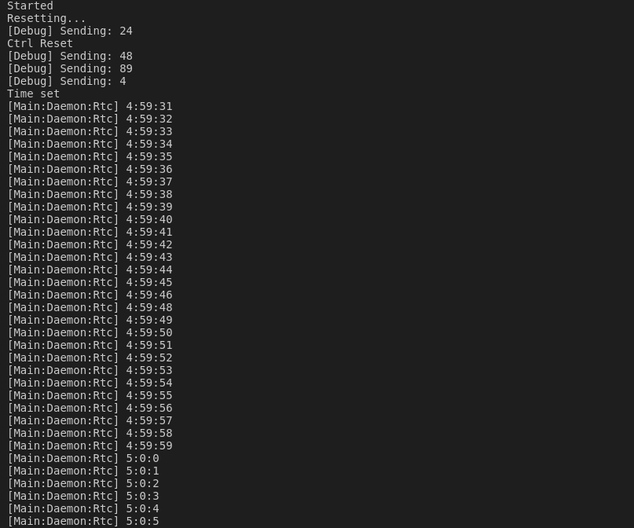

<h1>STM32-DS3231</h1>
<p align="center"> 

</p>

<p>Simple and Intuitive STM32 I2C HAL library for the DS3231 RTC<p>

<p>
Still in active development as there are still many routines yet to be implemented, Contributions are highly welcome!</p>


<h2> Contributing </h2>
A few notes:
<li>We adhere strictly to the Google C++ Style Guidelines. </li><li> Datasheet can be found <a href="https://datasheets.maximintegrated.com/en/ds/DS3231.pdf">HERE</a> (Really Helpful).</li>


<h2>Example</h2>
<p>It is advisable to use 400kHz frequency for the I2C.<br/>
Also, be sure to set the configuration of the I2C (rise and fall time especially) as described in the datasheet to get consistent results.<br/>
Just provide the Rx and Tx routines and you're good to go!
A really easy interface as demonstrated below:
</p>


```cpp

extern "C" {
#include "main.h"

#include <stdio.h>
#include "stm32f7xx_hal_i2c.h"
#include "stm32f7xx_hal_uart.h"
}

#include "DS3231.h"

extern "C" I2C_HandleTypeDef hi2c1;

extern "C" UART_HandleTypeDef huart3;

ds3231::Status RtcReceive(uint8_t* buffer, uint16_t size,
                          ds3231::duration_type timeout) {
  return static_cast<ds3231::Status>(HAL_I2C_Master_Receive(
      &hi2c1, 0b1101000 << 1, buffer, size, timeout.count()));
}

ds3231::Status RtcTransmit(const uint8_t* buffer, uint16_t size,
                           ds3231::duration_type timeout) {
  return static_cast<ds3231::Status>(HAL_I2C_Master_Transmit(
      &hi2c1, 0b1101000 << 1, const_cast<uint8_t*>(buffer), size,
      timeout.count()));
}

extern "C" int cxx_main() {
  printf("Started\n");

  ds3231::I2cInterface interface;
  interface.rx = RtcReceive;
  interface.tx = RtcTransmit;
  const auto timeout = ds3231::duration_type{500};
  ds3231::DS3231 rtc{interface};
  printf("Resetting...\n");
  auto rstatus = rtc.Reset(timeout);

  if (rstatus == ds3231::Status::Ok) {
    printf("Ctrl Reset\n");

  } else {
    printf("Unable to Reset\n");
  }

  auto s_status = rtc.SecondsFunc(30, timeout);
  auto m_status = rtc.MinutesFunc(59, timeout);
  auto h_status = rtc.HoursFunc(4, timeout);
  if (s_status == ds3231::Status::Ok && m_status == ds3231::Status::Ok &&
      h_status == ds3231::Status::Ok) {
    printf("Time set\n");
  } else {
    printf("Unable to set time\n");
  }
  HAL_Delay(500);
  while (true) {
    HAL_Delay(1000);
    auto res_s = rtc.SecondsFunc(timeout);
    auto res_m = rtc.MinutesFunc(timeout);
    auto res_h = rtc.HoursFunc(timeout);
    if (res_s.second == ds3231::Status::Ok &&
        res_m.second == ds3231::Status::Ok &&
        res_h.second == ds3231::Status::Ok) {
      printf("[Main:Daemon:Rtc] %u:%u:%u\n", res_h.first, res_m.first,
             res_s.first);
    } else {
      printf("[Main:Daemon:Rtc] Unable to get time\n");
    }
  }
  return 0;
}

```


<p> You should get something like this: </p>



<h2>Installation</h2>
Copy the header files from the <b>Inc</b> directory and the source files from the <b>Src</b> directory into the appropriate sections of your STM32 project.

<h2>License</h2>
<a href="LICENSE">Apache License 2.0</a>